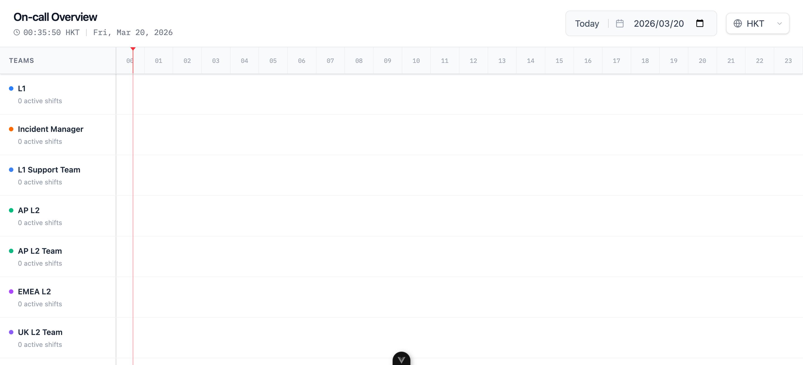

# Support Platform

[中文](./README.zh-CN.md)

Support Platform is the workspace container for the support roster product. It brings together the backend service, the Vue frontend, shared local development scripts, and the reusable Playwright automation project.

This repository is a Git superproject. The application repositories live in Git submodules, so always treat parent repository changes and submodule changes as separate Git histories.

## Projects

| Project | Path | Purpose |
|---------|------|---------|
| Support Roster Server | [`support-roster-server/`](./support-roster-server/) | Spring Boot backend for viewer APIs, workspace APIs, authentication, validation, imports, and PostgreSQL persistence. |
| Support Roster UI | [`support-roster-ui/`](./support-roster-ui/) | Vue 3 SPA for the public roster viewer, admin workspace, contact information, product updates, and protected tools. |
| Automation Test | [`automationtest/`](./automationtest/) | Playwright smoke and regression tests for login, route guards, workspace pages, permissions, and validation flows. |
| Development Scripts | [`scripts/dev/`](./scripts/dev/) | Local service orchestration scripts for starting, stopping, restarting, and health-checking the backend and frontend. |

## Product Snapshot

The public viewer presents an on-call timeline grouped by support teams, with date and timezone controls.



## Repository Layout

```text
support-platform/
├── support-roster-server/    # Git submodule: backend service
├── support-roster-ui/        # Git submodule: frontend application
├── automationtest/           # Parent-repo Playwright automation project
├── scripts/dev/              # Parent-repo local development scripts
├── docs/                     # Parent-repo supporting documents
├── test/                     # Parent-repo visual/test assets
└── .plans/                   # Local planning notes created by agents
```

## Submodule Workflow

The parent repository records only the submodule Git SHA, not the file contents inside each submodule.

```bash
git submodule status
git submodule update --init --recursive
```

When changing a submodule:

1. Commit and push changes inside the submodule repository.
2. Return to this parent repository.
3. Commit the updated submodule pointer.
4. Open or merge pull requests in dependency order: submodule first, parent repository second.

## Local Development

The preferred local entry point is the restart script:

```bash
./scripts/dev/restart-all.sh
```

It checks PostgreSQL readiness, restarts backend and frontend services, waits for health checks, and writes logs to `.dev-runtime/logs/`.

Default endpoints:

| Service | URL |
|---------|-----|
| Frontend | `http://127.0.0.1:5173` |
| Backend health | `http://127.0.0.1:8080/actuator/health` |
| Backend API | `http://127.0.0.1:8080/api` |

## Browser Automation

Use the shared automation project for login, workspace smoke, route guard, permission, and validation regression checks:

```bash
cd automationtest
npm install
npm run precheck
npm run test:smoke
```

Default smoke credentials for local workspace testing are:

```text
AUTOTEST_STAFF_ID=123456
AUTOTEST_PASSWORD=12345678
```

## Documentation Map

| Area | Entry Point |
|------|-------------|
| Backend README | [`support-roster-server/README.md`](./support-roster-server/README.md) |
| Backend specs | [`support-roster-server/.specs/_index.md`](./support-roster-server/.specs/_index.md) |
| Frontend README | [`support-roster-ui/README.md`](./support-roster-ui/README.md) |
| Frontend specs | [`support-roster-ui/.specs/spec.md`](./support-roster-ui/.specs/spec.md) |
| Automation README | [`automationtest/README.md`](./automationtest/README.md) |
| Dev scripts README | [`scripts/dev/README.md`](./scripts/dev/README.md) |

## License

The parent workspace is released under the [Apache License 2.0](./LICENSE). Submodules may carry their own license files; check each project before redistributing it independently.
