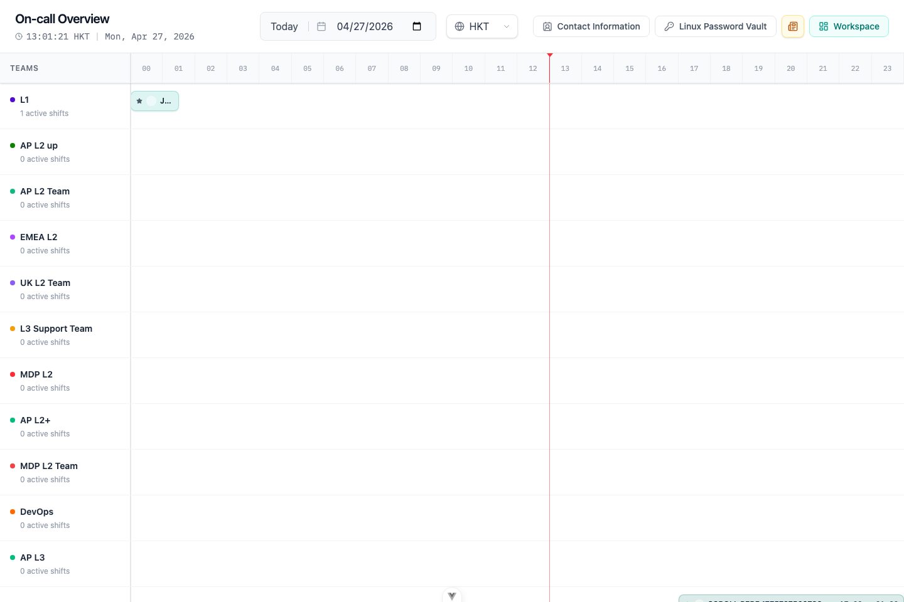
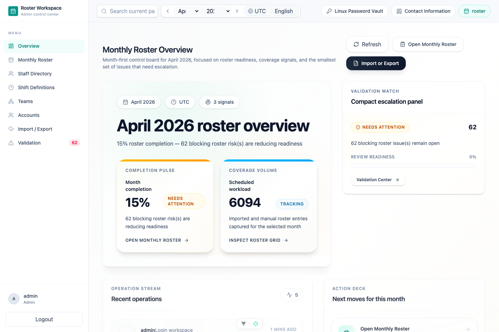
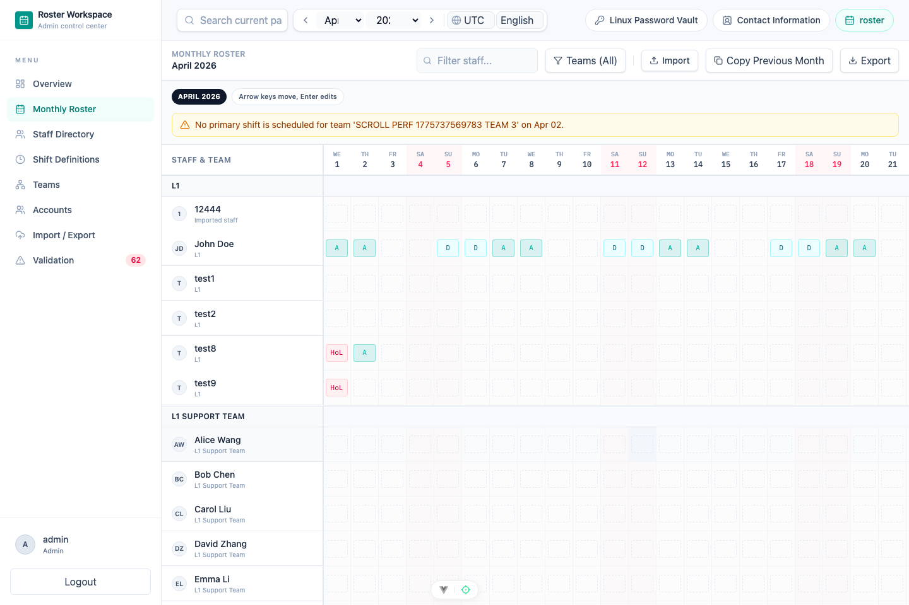
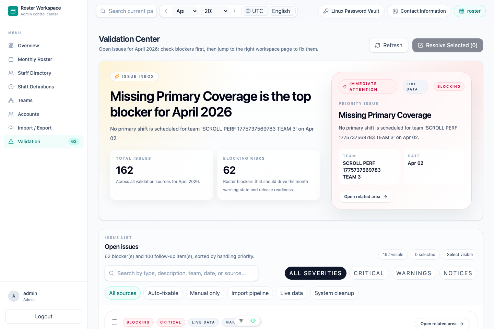
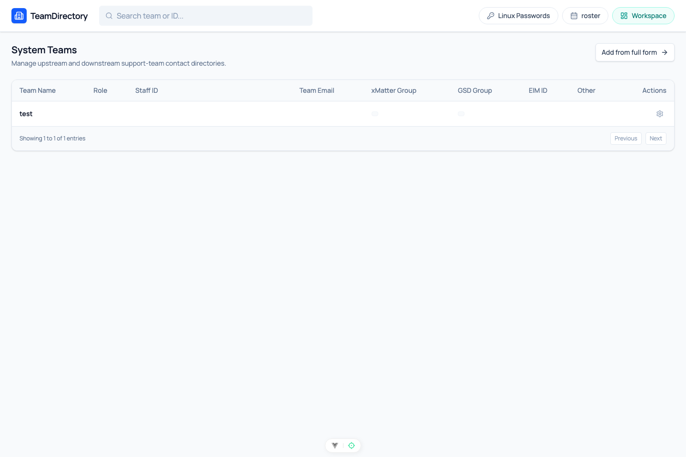

# Support Platform

[中文](./README.zh-CN.md)


Support Platform is the parent workspace for a support roster system that combines a Spring Boot API, a Vue 3 public/admin UI, local development orchestration, and reusable Playwright regression automation.

It is designed for teams that need to publish on-call coverage, manage roster data, validate scheduling quality, and keep browser smoke coverage close to the full local stack.

## Workspace Components

| Component | Path | Purpose |
|-----------|------|---------|
| Support Roster Server | [`support-roster-server/`](./support-roster-server/) | Spring Boot backend for viewer APIs, workspace APIs, authentication, validation, imports, and PostgreSQL persistence. |
| Support Roster UI | [`support-roster-ui/`](./support-roster-ui/) | Vue 3 SPA for the public roster viewer, admin workspace, contact information, product updates, and protected tools. |
| Automation Test | [`automationtest/`](./automationtest/) | Playwright smoke and regression tests for login, route guards, workspace pages, permissions, and validation flows. |
| Development Scripts | [`scripts/dev/`](./scripts/dev/) | Local orchestration scripts for starting, stopping, restarting, and health-checking the backend and frontend. |

## Screenshots

The public viewer shows on-call coverage by support team with date and timezone controls. Workspace pages provide roster management, validation, permissions, and operational workflows.

| Public viewer | Workspace overview |
|---|---|
|  |  |

| Monthly roster | Validation center |
|---|---|
|  |  |

| Contact information |
|---|
|  |

## Quick Start

```bash
git submodule update --init --recursive
./scripts/dev/restart-all.sh
```

Default local endpoints:

| Service | URL |
|---------|-----|
| Frontend | `http://127.0.0.1:5173` |
| Backend health | `http://127.0.0.1:8080/actuator/health` |
| Backend API | `http://127.0.0.1:8080/api` |

## Repository Model

This repository is a Git superproject. The backend and frontend live in Git submodules, so application code changes and parent workspace changes are committed separately.

The parent repository records only the Git SHA of each submodule. It does not contain the backend or frontend source files directly.

```bash
git submodule status
git submodule update --init --recursive
```

When changing a submodule:

1. Commit and push inside that submodule first.
2. Return to this repository.
3. Commit the updated submodule pointer.
4. Merge or push in dependency order: submodule first, parent repository second.

## Repository Layout

```text
support-platform/
├── support-roster-server/    # Git submodule: backend service
├── support-roster-ui/        # Git submodule: frontend application
├── automationtest/           # Parent-repo Playwright automation project
├── scripts/dev/              # Parent-repo local development scripts
├── docs/assets/screenshots/  # Curated README screenshots
├── docs/                     # Parent-repo supporting documents
└── test/                     # Parent-repo test assets
```

## Local Development

The preferred local entry point is:

```bash
./scripts/dev/restart-all.sh
```

It checks PostgreSQL readiness, restarts backend and frontend services, waits for health checks, and writes logs to `.dev-runtime/logs/`.

Useful direct commands:

```bash
./scripts/dev/start-backend.sh
./scripts/dev/start-frontend.sh
./scripts/dev/stop-all.sh
```

## Testing

Use the shared automation project for login, workspace smoke, route guard, permission, and validation regression checks:

```bash
cd automationtest
npm install
npm run precheck
npm run test:smoke
```

Default local administrator credentials for browser verification are documented in [`AGENTS.md`](./AGENTS.md). Environment-driven automation credentials live in [`automationtest/.env.example`](./automationtest/.env.example).

## Documentation Map

| Area | Entry Point |
|------|-------------|
| Backend README | [`support-roster-server/README.md`](https://github.com/yachi666/support-roster-server/blob/main/README.md) |
| Backend specs | [`support-roster-server/.specs/_index.md`](https://github.com/yachi666/support-roster-server/blob/main/.specs/_index.md) |
| Frontend README | [`support-roster-ui/README.md`](https://github.com/yachi666/support-roster-ui/blob/main/README.md) |
| Frontend specs | [`support-roster-ui/.specs/spec.md`](https://github.com/yachi666/support-roster-ui/blob/main/.specs/spec.md) |
| Automation README | [`automationtest/README.md`](./automationtest/README.md) |
| Dev scripts README | [`scripts/dev/README.md`](./scripts/dev/README.md) |

## License

The parent workspace is released under the [Apache License 2.0](./LICENSE). Submodules may carry their own license files; check each project before redistributing it independently.
