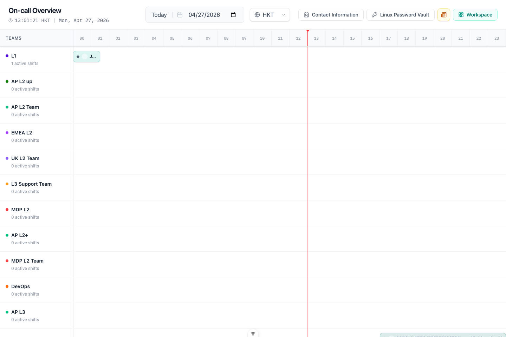
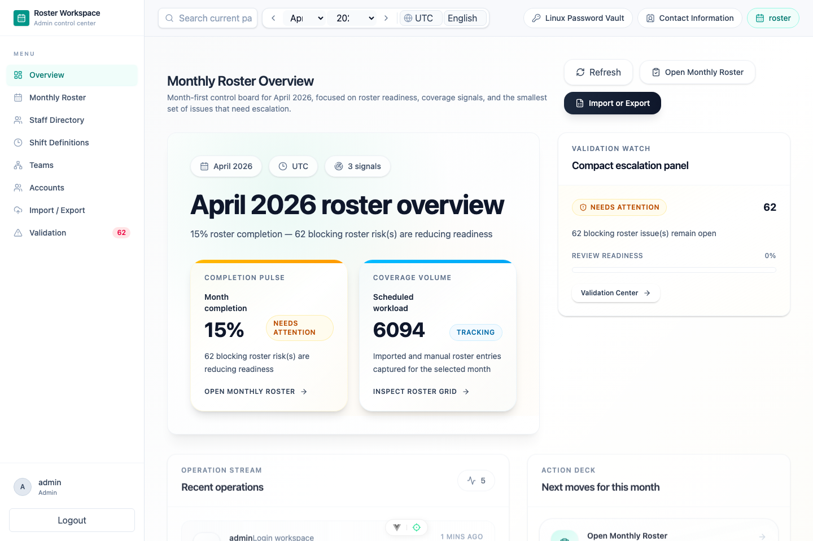
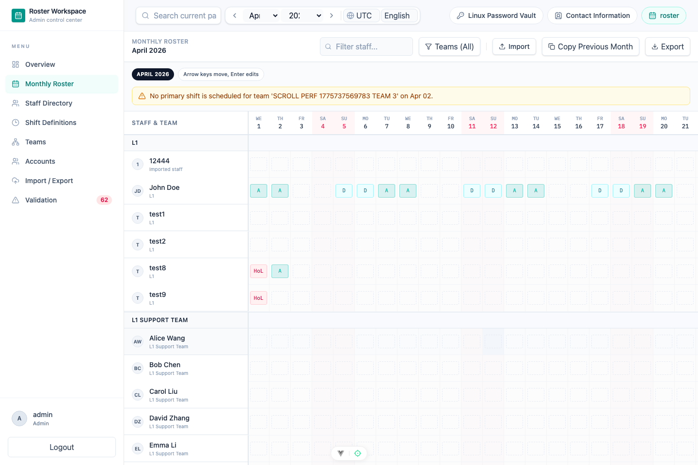
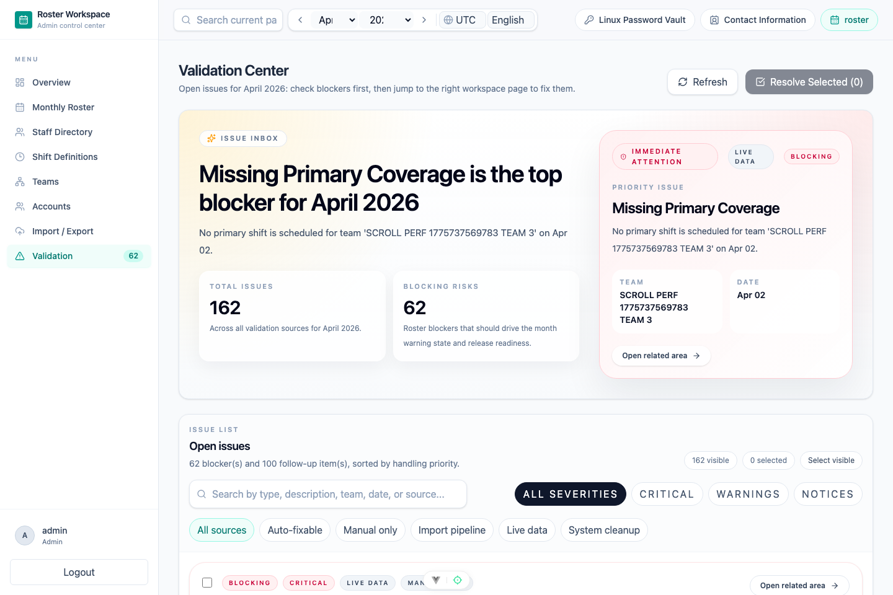
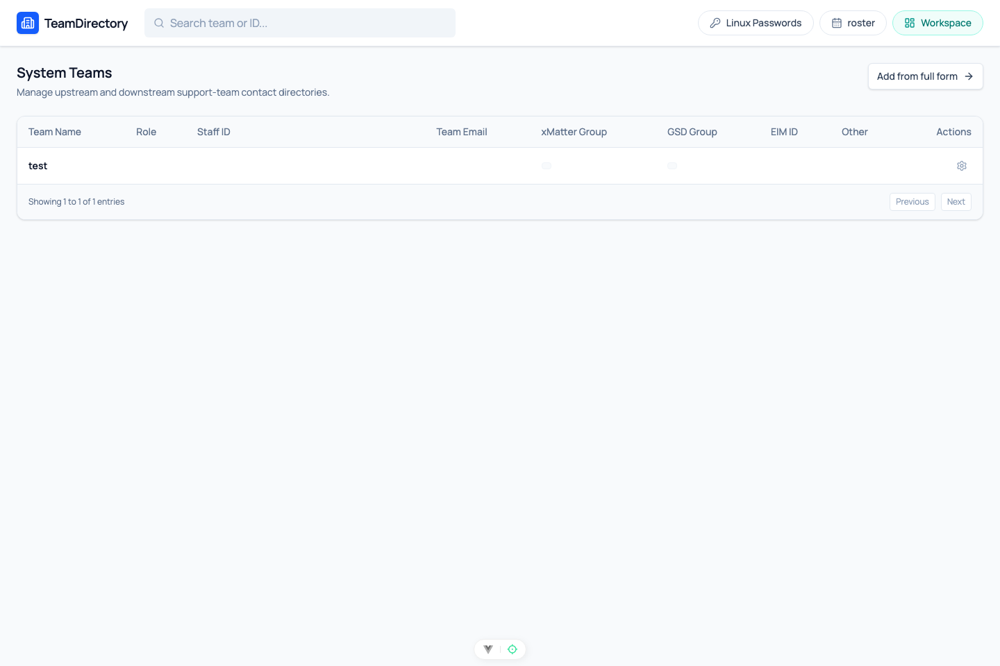

# 🛡️ Support Platform

<div align="center">

**A complete on-call roster management system with public viewer and workspace administration**

[中文文档](./README.zh-CN.md) • [Server Repo](https://github.com/yachi666/support-roster-server) • [UI Repo](https://github.com/yachi666/support-roster-ui)

[](./LICENSE)
[](https://github.com/yachi666/support-roster-server)
[](https://github.com/yachi666/support-roster-ui)
[](./automationtest)

</div>

---

## 📖 Overview

Support Platform is the **workspace superproject** that orchestrates a full-stack support roster system. It brings together a Spring Boot backend, Vue 3 frontend, local development automation, and end-to-end browser testing in a unified Git superproject structure.

**Designed for teams that need to:**
- 📅 Publish on-call coverage with date and timezone controls
- 👥 Manage roster data, contacts, and scheduling
- ✅ Validate roster quality and catch configuration errors
- 🧪 Maintain browser regression tests alongside the full local stack

---

## ✨ Highlights

- **🔐 Multi-tier authentication** – Public viewer access plus workspace-level permissions
- **📊 Rich roster management** – Monthly planning, validation center, and contact information
- **🌐 Timezone-aware** – Global team support with flexible date/timezone controls
- **🤖 Full automation coverage** – Playwright tests for login, permissions, routing, and workflows
- **🚀 One-command local dev** – Integrated scripts for PostgreSQL + backend + frontend orchestration

---

## ⚡ Quick Start

```bash
# Clone and initialize submodules
git clone https://github.com/yachi666/support-platform.git
cd support-platform
git submodule update --init --recursive

# Start everything (PostgreSQL + backend + frontend)
./scripts/dev/restart-all.sh
```

**Default local endpoints:**

| Service | URL | Purpose |
|---------|-----|---------|
| 🌐 **Frontend** | `http://127.0.0.1:5173` | Public viewer + admin workspace |
| 🔌 **Backend API** | `http://127.0.0.1:8080/api` | REST endpoints |
| 💚 **Health check** | `http://127.0.0.1:8080/actuator/health` | Service status |

> **Default admin credentials:** username `admin`, password `admin` (see [`AGENTS.md`](./AGENTS.md) for details)

---

## 📦 Repository Components

This repository is a **Git superproject**. The backend and frontend live in **Git submodules**, so application code and workspace orchestration evolve independently.

| Component | Type | Purpose |
|-----------|------|---------|
| **[Support Roster Server](https://github.com/yachi666/support-roster-server)** | Submodule | Spring Boot backend • Viewer/workspace APIs • Authentication • Validation • PostgreSQL persistence |
| **[Support Roster UI](https://github.com/yachi666/support-roster-ui)** | Submodule | Vue 3 SPA • Public roster viewer • Admin workspace • Contact management |
| **[Automation Test](./automationtest/)** | Parent repo | Playwright regression suite • Login/permissions/routing/validation |
| **[Development Scripts](./scripts/dev/)** | Parent repo | Local orchestration • Start/stop/restart/health checks |

---

## 📸 Product Screenshots

**Public viewer** shows on-call coverage by team with date and timezone controls. **Workspace pages** provide roster planning, validation, contact management, and admin tools.

<table>
  <tr>
    <td width="50%"><b>Public Roster Viewer</b><br/></td>
    <td width="50%"><b>Workspace Overview</b><br/></td>
  </tr>
  <tr>
    <td width="50%"><b>Monthly Roster Planner</b><br/></td>
    <td width="50%"><b>Validation Center</b><br/></td>
  </tr>
  <tr>
    <td colspan="2"><b>Contact Information</b><br/></td>
  </tr>
</table>

---

## 🏗️ Repository Structure

```text
support-platform/               # ← You are here (Git superproject)
├── support-roster-server/      # Git submodule → backend service
├── support-roster-ui/          # Git submodule → frontend application
├── automationtest/             # Playwright automation (parent repo)
├── scripts/dev/                # Local development scripts (parent repo)
├── docs/                       # Workspace documentation
└── test/                       # Test fixtures and seed data
```

**Understanding submodules:**

The parent repository records only the **Git SHA** of each submodule, not the source files themselves. This keeps application development separate from workspace orchestration.

```bash
# Check submodule status
git submodule status

# Sync submodules to recorded commits
git submodule update --init --recursive
```

**When changing a submodule:**

1. Commit and push changes **inside the submodule** first
2. Return to the parent repository
3. Commit the updated submodule pointer
4. Merge/push in dependency order: **submodule first**, **parent second**

> 📘 See [`AGENTS.md`](./AGENTS.md) for detailed submodule workflow and detached HEAD handling

---

## 🛠️ Local Development

### Prerequisites

- **Java 21+** (for Spring Boot backend)
- **Node.js 20.19+ or 22.12+** (for Vue frontend)
- **PostgreSQL 16+** (local or remote)
- **Git** with submodule support

### Environment Setup

1. **Initialize submodules:**
   ```bash
   git submodule update --init --recursive
   ```

2. **Configure PostgreSQL:**
   ```bash
   # Default connection (adjust in scripts/dev/*.sh if needed)
   jdbc:postgresql://127.0.0.1:5432/support
   ```

3. **Start the stack:**
   ```bash
   ./scripts/dev/restart-all.sh
   ```

   This script:
   - ✅ Checks PostgreSQL readiness with `pg_isready`
   - 🛑 Stops existing listeners on ports `8080` and `5173`
   - 🚀 Starts backend and frontend in the background
   - 💚 Waits for health checks at both endpoints
   - 📝 Writes runtime logs to `.dev-runtime/logs/`

### Individual Commands

```bash
./scripts/dev/start-backend.sh     # Start backend (foreground)
./scripts/dev/start-frontend.sh    # Start frontend (foreground)
./scripts/dev/stop-all.sh          # Stop all services
```

> 📘 See [`scripts/dev/README.md`](./scripts/dev/README.md) for environment variables and advanced configuration

---

## 🧪 Testing

Use the **shared automation project** for login, workspace smoke, route guards, permissions, and validation regression:

```bash
cd automationtest
npm install
npm run install:browsers    # Install Playwright browsers
npm run precheck            # Verify environment
npm run test:smoke          # Run smoke tests
```

> **Note:** `npm run test:smoke` automatically restarts backend and frontend services first. Use `npm run test:smoke:raw` if the local stack is already running.

**Coverage includes:**
- 🔐 Authentication flows and protected route redirects
- 📄 Workspace page smoke tests
- 🛡️ Admin-only navigation and permission checks
- ✅ Validation center regression scenarios
- 📋 Contact information CRUD operations

> 📘 See [`automationtest/README.md`](./automationtest/README.md) for detailed test documentation and configuration

---

## 📚 Documentation & Navigation

| Component | Documentation |
|-----------|---------------|
| **🖥️ Backend** | [README](https://github.com/yachi666/support-roster-server/blob/main/README.md) • [API Specs](https://github.com/yachi666/support-roster-server/blob/main/.specs/_index.md) |
| **🌐 Frontend** | [README](https://github.com/yachi666/support-roster-ui/blob/main/README.md) • [UI Specs](https://github.com/yachi666/support-roster-ui/blob/main/.specs/spec.md) |
| **🤖 Automation** | [Testing Guide](./automationtest/README.md) |
| **⚙️ Dev Scripts** | [Orchestration Docs](./scripts/dev/README.md) |
| **🔧 Workspace** | [Agent Instructions](./AGENTS.md) – Submodule workflow and conventions |

---

## 🤝 Contributing

This project follows a **Git superproject + submodules** model:

- **Application changes:** Contribute to [support-roster-server](https://github.com/yachi666/support-roster-server) or [support-roster-ui](https://github.com/yachi666/support-roster-ui) directly
- **Automation/scripts:** Contribute to this repository's `automationtest/` or `scripts/` directories
- **Submodule updates:** Follow the workflow in [`AGENTS.md`](./AGENTS.md)

Please check each component's README for specific contribution guidelines.

---

## 📄 License

The parent workspace is released under the [MIT License](./LICENSE).

**Note:** Submodules may carry their own licenses. Check each project's `LICENSE` file before redistributing independently.

---

<div align="center">

**Made with ❤️ for on-call teams**

[Report Issues](https://github.com/yachi666/support-platform/issues) • [Server Repo](https://github.com/yachi666/support-roster-server) • [UI Repo](https://github.com/yachi666/support-roster-ui)

</div>
