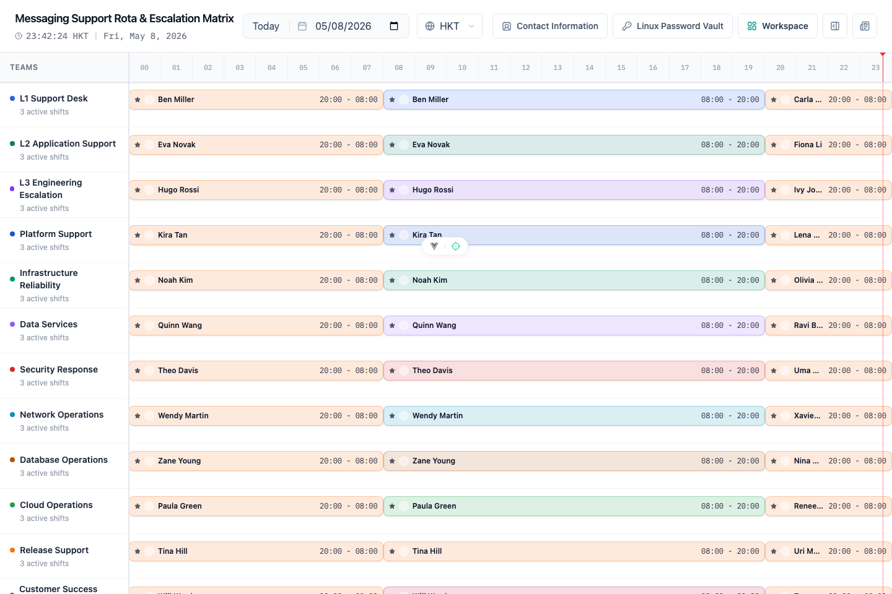
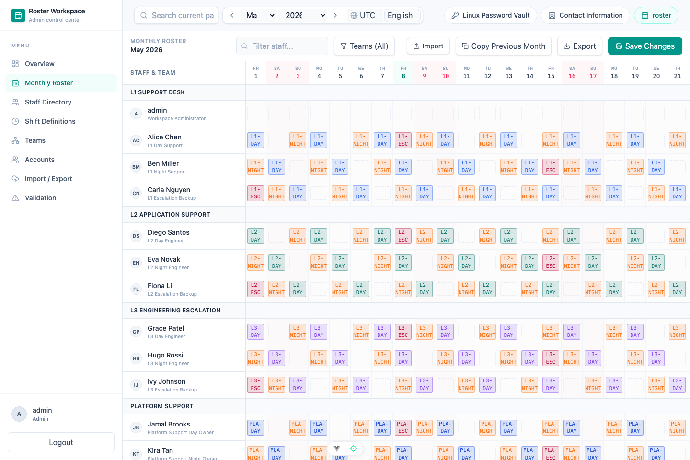
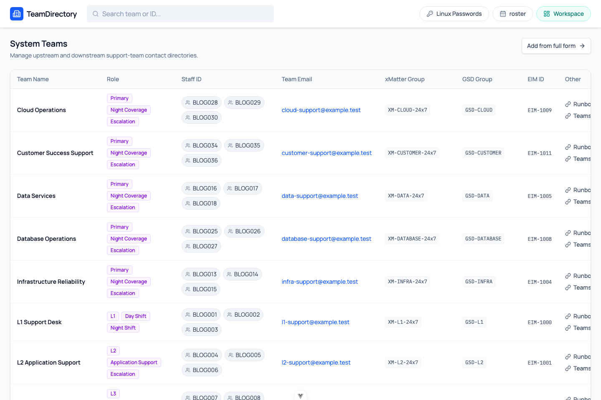

# 🛡️ Support Platform：值班排班展示平台的产品与工程实践

> 从“谁今天值班？”到“打开看板就知道”：一个面向技术支持、运维、平台团队和任何固定值班团队的排班平台实践。



## 简介

如果你的团队也有固定技术支持、On-call、二线支持或升级处理人，应该对这些场景很熟：排班表散落在 Excel、聊天群、Wiki；临时换班靠口头同步；外部同事想找支持人时，不知道看哪一个版本；月底复盘时，又很难判断排班是否真的完整。

所以我做了一个 **Support Platform**：一个完整的值班排班管理与公开展示平台。它既能给所有人看“今天谁值班”，也能给管理员维护团队、人员、班次、月度排班、联系人信息和校验问题。

> 说明：这个产品的 UI 设计、代码实现、文档、测试，以及这篇博客本身，都由 AI 生成并在人工审阅下迭代完成。下面主要聊产品能力、工程实现和验证链路。

## 为什么需要这样的平台？

值班排班看起来很简单，本质上却是一个跨团队协作问题。

- 📅 **排班要公开**：业务同事、其它技术团队、值班经理都需要快速知道当前支持人。
- 🌍 **时区要准确**：全球团队不能只看一个本地时间。
- 👥 **联系人要完整**：找到值班人还不够，还要知道团队邮箱、xMatter、GSD、EIM、Runbook。
- ✅ **质量要可回归**：排班保存、权限边界、导入导出和页面流程，都应该能被测试稳定覆盖。
- 🔐 **权限要分层**：公开看板可以开放，管理工作台需要登录和角色控制。

换句话说，这不是“做一张漂亮表格”，而是把排班这件事产品化。

## 产品长什么样？

### 1. 公开排班看板：不用登录也能回答“今天找谁”

公开看板按团队展示当天值班覆盖，并带有日期、时区和当前时间线。新的演示数据里，L1、L2、L3 以及多个支持团队都有白班和夜班覆盖，保证一天 24 小时都能看到当前负责人。对其它部门来说，它就是一个统一入口：不用翻群消息，不用问“最新版排班表在哪”，打开页面就能看到当前应该找谁。


### 2. 月度排班：像表格一样直观，但背后是结构化数据

月度排班页面保留了大家熟悉的表格心智：左边是人员和团队，右边是日期格子，班次 code 用不同颜色呈现。管理员可以导入、复制上月、导出、保存修改，也能直接看到校验提醒。



### 3. 联系人目录：排班之外，还要知道怎么升级

很多支持场景里，“谁值班”只是第一步。真正处理问题时，还需要团队邮箱、xMatter group、GSD group、EIM ID、Runbook、Teams Channel 等信息。联系人目录把这些信息放到一个独立入口，让跨部门协作更顺。



## 实现方案

这个项目不是单个前端页面，而是一个完整的全栈工作区：

- 🖥️ **后端**：Spring Boot 4 + PostgreSQL，提供公开 Viewer API、Workspace 管理 API、认证授权、排班保存和导入导出服务。
- 🌐 **前端**：Vue 3 + Vite，包含公开看板、登录页、工作台布局、月度排班、团队管理、员工目录、班次定义、联系人目录等页面。
- 🧩 **工程结构**：父仓库作为 Git superproject，后端和前端是独立 submodule；开发脚本统一编排 PostgreSQL、后端和前端。

整体思路是：公开访问和管理能力分层，展示数据和维护数据共用同一套领域模型，后端负责持久化和业务规则，前端负责把“谁值班、怎么联系、怎么维护”表达清楚。

```text
Support Platform
├── Public Viewer
│   ├── Teams
│   ├── Daily shifts
│   └── Timezone-aware timeline
├── Workspace Admin
│   ├── Staff / Teams / Shift Definitions
│   ├── Monthly Roster Planner
│   └── Import / Export
├── Contact Information
│   ├── Team email
│   ├── xMatter / GSD / EIM
│   └── Runbook links
└── Automation
    └── Playwright smoke and regression tests
```

## GitHub 链接

项目按 superproject + submodule 的方式组织，方便前后端独立演进，也方便在父仓库里统一维护脚本、文档、自动化测试和截图资产。

- 主仓库：[support-platform](https://github.com/yachi666/support-platform)
- 后端服务：[support-roster-server](https://github.com/yachi666/support-roster-server)
- 前端界面：[support-roster-ui](https://github.com/yachi666/support-roster-ui)
- 自动化测试工程：[automationtest](https://github.com/yachi666/support-platform/tree/main/automationtest)
- 博客与截图资产：[docs](https://github.com/yachi666/support-platform/tree/main/docs)

## AI 工具链：从设计、编码到回归验证

这部分不展开 AI 或 Agent 的基础概念。面向开发同学，更有价值的是看清楚工具在交付链路里的边界：哪些适合快速改动，哪些适合跨文件推进，哪些适合视觉资产，哪些适合把验证沉淀下来。

- **Copilot CLI YOLO 模式**：用于推进明确的小改动、脚本调整和重复性代码修改，适合风险可控、反馈很快的任务。
- **Codex CLI**：用于跨文件理解、实现方案拆解、前后端联动修改、文档整理和提交前检查。
- **Codex + GPT image2**：当界面需要补充 UI 资源时，直接生成可用的视觉素材，例如 icon、占位图或轻量说明图，再放回前端资源体系里使用。
- **Agent plugin `Superpower`**：用于把需求澄清、设计、测试驱动、调试和验证这些步骤显式化，避免只追求生成速度。
- **Skills `frontend-design`**：用于约束前端体验，让界面符合排班管理这类内部工具的使用场景，而不是停留在“能显示”的状态。
- **Playwright CLI + skills**：用于驱动真实浏览器做登录、跳转、截图、页面检查和回归脚本沉淀，让前端验证从一次性手工检查变成可重复资产。

这套组合的价值不在于“用了多少 AI 工具”，而在于让设计、实现、素材、验证和文档进入同一条工程反馈链路。每个工具负责自己擅长的部分，最后由测试和浏览器结果来约束质量。

## 自动化测试：把浏览器验证沉淀成回归资产

这次开发里，自动化测试不是最后补上的“保险丝”，而是产品演进的一部分。后端用测试固定规则，前端用真实浏览器验证关键路径，然后把稳定路径沉淀到 Playwright，形成后续回归资产。

后端开发更偏 **测试驱动**：接口、领域逻辑、权限边界、数据保存规则先通过单元测试和服务测试固定下来。比如排班保存、联系人信息创建、权限策略、导入导出这些逻辑，都适合在 Spring Boot 测试里直接验证。这样改实现时，不需要靠肉眼判断“应该没坏”，而是让测试告诉我们行为有没有变。

前端则更适合让 AI 参与 **真实浏览器验证**：启动本地后端和前端，用浏览器登录、跳转、点击、筛选、保存、截图，直接观察页面是不是符合预期。像登录流程、工作台路由、月度排班、联系人目录这类功能，只看组件测试不够，必须走一遍真实用户路径。

这些浏览器验证最终会沉淀到独立的 `automationtest/` 工程里，用 Playwright 做可重复回归：

- 🔐 登录、退出和受保护路由跳转
- 🧭 工作台核心页面冒烟
- 🛡️ 管理员权限和只读/编辑边界
- 📋 联系人目录创建与展示
- 📅 月度排班编辑、导入、复制上月等关键路径
- ✅ 排班保存、导入导出和核心页面状态的回归场景

后续新增功能也会沿用这个流程：**后端先用测试锁住规则，前端先用 AI 浏览器验证跑通体验，再把稳定路径沉淀成 Playwright 脚本**。这样新增功能不会只停留在“当前能跑”，而是留下可以复用的验证路径。

## 哪些团队可以复用？

我一开始是为技术支持排班做的，但它其实适合任何有固定值班机制的团队：

- SRE / DevOps on-call
- L1 / L2 / L3 Support
- 数据平台值班
- 应用平台值班
- 安全响应值班
- 发布窗口支持
- 跨区域业务支持团队

只要你的团队经常被问“今天谁负责？”、“这个问题应该升级给谁？”、“这个月排班有没有漏？”，这个平台就有价值。

## 欢迎贡献和提出需求

如果你所在团队也有类似的排班、值班、支持升级或跨部门协作场景，欢迎直接提需求或参与贡献：

- 产品需求和使用场景可以提到：[support-platform issues](https://github.com/yachi666/support-platform/issues)
- 后端接口、数据模型、权限和导入导出能力可以看：[support-roster-server](https://github.com/yachi666/support-roster-server)
- 前端页面、交互、国际化和可视化体验可以看：[support-roster-ui](https://github.com/yachi666/support-roster-ui)
- 浏览器回归、冒烟用例和测试数据生命周期可以从：[automationtest](https://github.com/yachi666/support-platform/tree/main/automationtest) 开始

特别欢迎这几类反馈：不同部门的值班模型、审批/换班流程、通知集成、更多时区场景、权限边界、导入导出格式，以及真实团队在落地时遇到的维护成本问题。

## 最后

这个产品最大的收益不是替代一张 Excel，而是让值班信息从“人肉同步”变成“可靠系统”。

对使用者来说，它提供一个清晰入口；对管理员来说，它提供结构化维护和校验；对其它部门来说，它提供可复制的值班协作模式。

而对我来说，它也是一次很好的实践：当需求清晰、反馈及时、验证自动化，内部工具可以很快从想法沉淀成可用系统。✨
